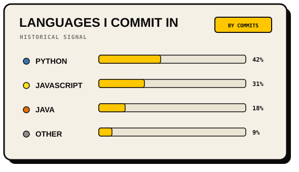
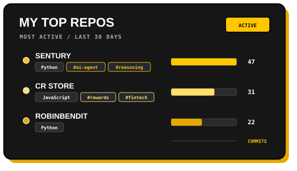
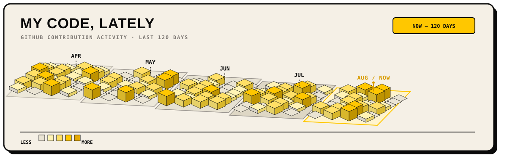

# Ryan Leonel

  

### About Me

Estudante de Análise e Desenvolvimento de Sistemas (ADS).

Focused on software development, automation, systems integration, AI architecture, and infrastructure.

---

### Tech Stack

#### Languages

  

#### Databases

  
  

#### Cloud & Infrastructure

  
  

#### Tools & Development

  

#### Data & Automation

  
  
  

---

### Featured Projects

#### ⚡ Quick Setup VPS
CLI that simplifies the initial configuration and security hardening of Linux VPS environments.

---

### GitHub Activity & Metrics

  
  

  

---

  

  <i>Compilando ideias e consumindo café desde a inicialização ☕</i>

